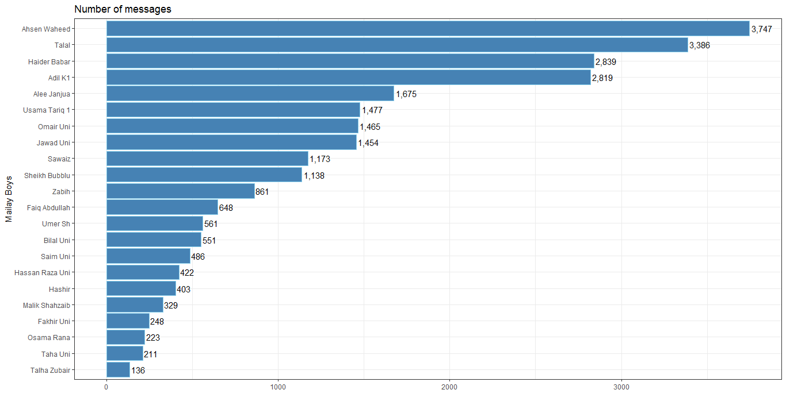

# WhatsApp-Chat-Sentimental-Analysis
WhatsApp seems to become increasingly important not just as a messaging service but also as a social network—thanks to its group chat capabilities. Furthermore, retrieving chat logs from the Android or iOS app is very straightforward: Simply choose More in the menu of a chat, then Export chat and export the history to a txt file.


## Using rwhatsapp package for reading whatsapp Chat

```
install.packages("rwhatsapp")
library(rwhatsapp)

chat <- rwa_read("C:/Users/ahsen/OneDrive/Documents/WhatsApp Chat with Just Jaakut Gang.txt")


chat <- chat[!is.na(chat$author),] #Removing rows having NA as author

chat <- subset(chat, !(text=="<Media omitted>" )) 

```

## Total Messages sent by each user

```
chat %>%
  count(author) %>%
  ggplot(aes(x = reorder(author, n), y = n)) +
  geom_bar(stat="identity", color='skyblue',fill='steelblue') +
  geom_text(aes(label = scales::comma(n)), hjust = -0.1)+
  ylab("") + xlab("Mailay Boys") +
  coord_flip() +
  ggtitle("Number of messages")+ theme_bw()
  
  ```
  
  
  
  
  
## How does it look if we compare favourite words? I use the excellent tidytext package to get this task done.
### Most often Used Words

```
library(tidytext)
chat %>%
  unnest_tokens(input = text,
                output = word) %>%
  count(author, word, sort = TRUE) %>%
  group_by(author) %>%
  top_n(n = 10, n) %>%
  ggplot(aes(x = reorder_within(word, n, author), y = n, fill = author)) +
  geom_col(show.legend = FALSE) +
  ylab("") +
  xlab("") +
  coord_flip() +
  facet_wrap(~author, ncol = 8, scales = "free_y") +
  scale_x_reordered() +
  ggtitle("Most often used words")
  
 ```
 
 [!Common Words](images/usedword_plot.png)

## Check the count of any word

Here I have used "bc" word for count. 
```

chat %>%unnest_tokens(input = text, output = word) %>%
       filter(str_detect(word, "bc")) %>%
       count(author,word, sort = TRUE) %>%
       subset(word=="bc") %>%
       ggplot(aes(x=reorder(author,n),y =n))+geom_bar(stat = "identity", fill= "#d9534f")+
       geom_text(aes(label = scales::comma(n)), hjust = -0.1)+
       coord_flip()+
       ylab("")+
       xlab("")+
       ggtitle("BC used")+theme_bw()
```
 [!word Count](images/anyword_plot.png)
 
 
 ## Unique Words by each person

```

chat %>%
  unnest_tokens(input = text,
                output = word) %>%

  group_by(author) %>%
  summarise(Unique_Words = n_distinct(word)) %>%

  ggplot(aes(x = reorder(author, Unique_Words),
             y = Unique_Words,
             fill = author)) +
  geom_bar(stat = "identity",show.legend = "FALSE") +
  
  geom_text(aes(label = scales::comma(Unique_Words)), hjust = -0.1) +
  ylab("unique words") +
  xlab("") +
    coord_flip()+theme_minimal()
    
  ```
  [!Unique word](images/uniqueword_plot.png)


## Sentimental Analysis

```
library(textdata)
Sentiment <- get_nrc_sentiment(chat$text)
Sentiment <- cbind(Sentiment,chat$text)
Sentiment <- cbind(Sentiment,chat$author)
Sentiment_Analysis <-aggregate(Sentiment[,c(1:10)], by=list(Players=Sentiment$`chat$author`), FUN=sum)
Sentiment_Analysis %>% tidyr::gather("id", "value", 2:11) %>% 
       ggplot(., aes(Players, value))+
       geom_col()+
       coord_flip()+
       facet_wrap(~id, nrow = 2)+
       xlab("")+
       ylab("")+theme_bw()
       
```
[!Sentimental Analysis](images/sentiment_plot.png)

